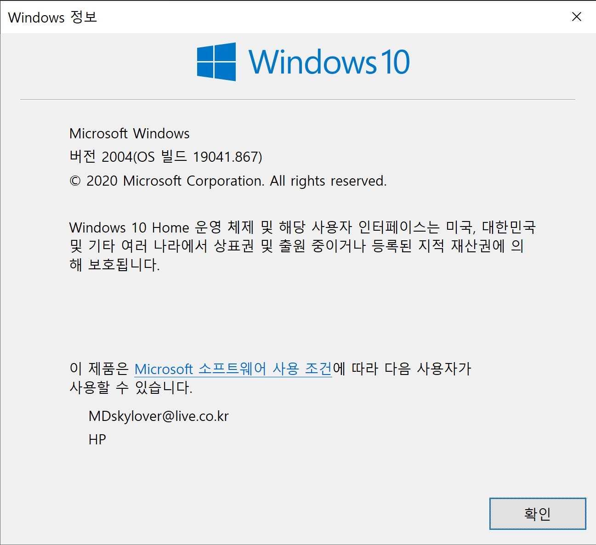
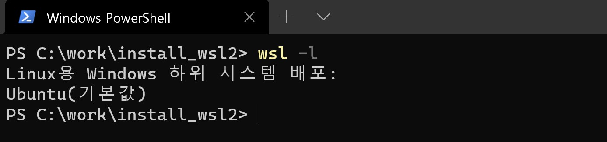
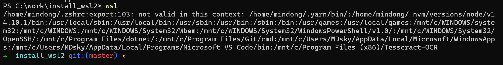
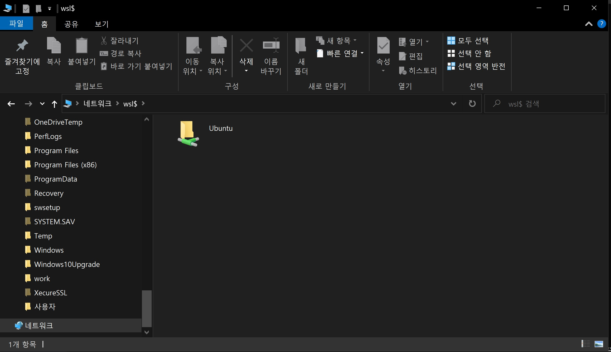

# WSL2 install tutorial
* Author: MinDong Sung
* Date: 2021.04.16
---

## WSL(Windows Sub Linux 이란? 
* Windows10 운영체제에서 리눅스 운영체제의 쉘,시스템을 사용할 수 있도록 지원해주는 기능

* Architecture

    
## Pre-requisite
1. windows version을 확인한다.(powershell 또는 terminal에서 `winver`입력 후 실행) 
    ```
    PS c:\Users\[USERNAME]> winvar
    ``` 
    

    * windows version은 **2004**이상이어야 한다. 

## Process
1. dism 실행 (관리자 모드에서 실행시킨 powershell or terminal에서 다음 명령어를 실행시킨다.)
    ```
    dism.exe /online /enable-feature /featurename:Microsoft-Windows-Subsystem-Linux /all /norestart
    dism.exe /online /enable-feature /featurename:VirtualMachinePlatform /all /norestart
    ```

2. Ubuntu 설치 - 아래 링크를 클릭하여 설치 파일을 다운로드 받아서 설치한다. 

    * [Ubuntu version 18.04](https://www.microsoft.com/ko-kr/p/ubuntu-1804-lts/9n9tngvndl3q?activetab=pivot:overviewtab)
    * [Ubuntu version 20.04](https://www.microsoft.com/ko-kr/p/ubuntu-2004-lts/9n6svws3rx71?activetab=pivot:overviewtab)

3. wsl version 및 os 확인
    * 실제로 구동할 때는 terminal에서 `wsl`만 실행시키면 되나, WSL2인지, Ubuntu가 설치되어 있는지 확인할 필요가 있다. 
    * 운영체제 확인
        ```
        wsl -l
        ```
        

    * Version 확인
        ```
        wsl -l -v
        ```
        

        * version이 2이어야 한다.

4. wsl 실행
    ```
    wsl
    ```

    

## 탐색기에서 linux 디렉토리 열기
* wsl로 linux를 실행시킨 상태에서 탐색기를 열어 주소창에 `\\wsl$\`를 입력하게 되면 WSL2가 네트워크 드라이브 형식으로 나온다. 
   


## 설치 권장
1. [Windows terminal 1.0v](https://www.microsoft.com/ko-kr/p/windows-terminal/9n0dx20hk701?rtc=1&activetab=pivot:overviewtab)

## Reference
* [https://medium.com/@cratios48/wsl-2-%EC%9D%98-%EC%9D%BC%EB%B0%98-%EC%82%AC%EC%9A%A9-9e8dfc75efae](https://medium.com/@cratios48/wsl-2-%EC%9D%98-%EC%9D%BC%EB%B0%98-%EC%82%AC%EC%9A%A9-9e8dfc75efae)
* [https://www.44bits.io/ko/post/wsl2-install-and-basic-usage](https://www.44bits.io/ko/post/wsl2-install-and-basic-usage)
* [https://www.itworld.co.kr/news/153272](https://www.itworld.co.kr/news/153272)